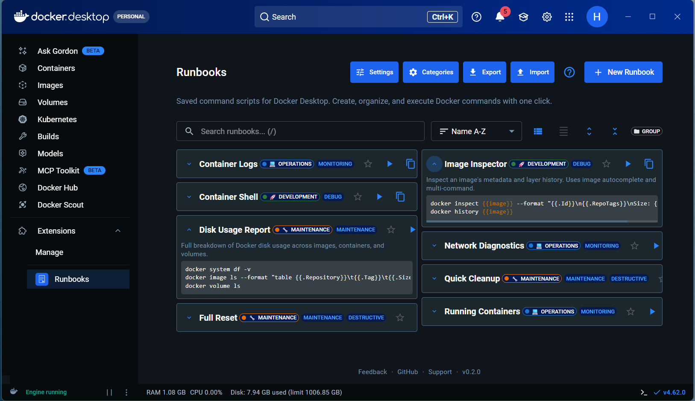
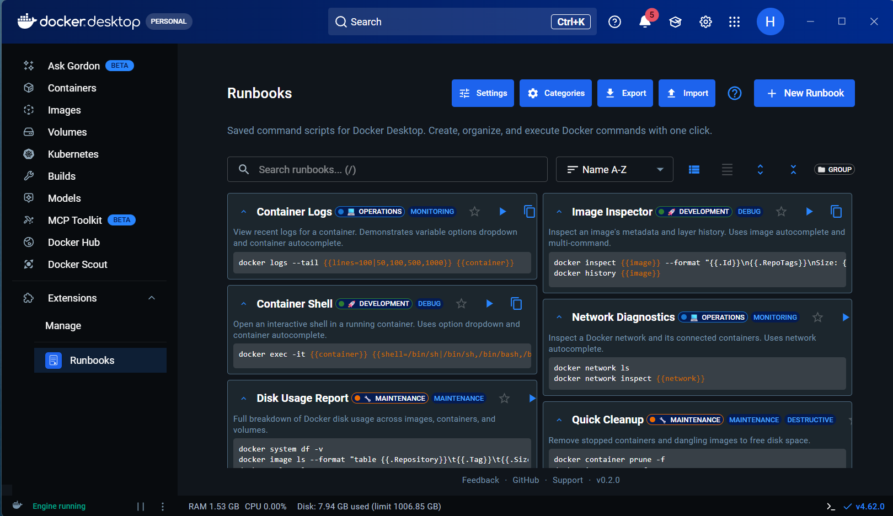
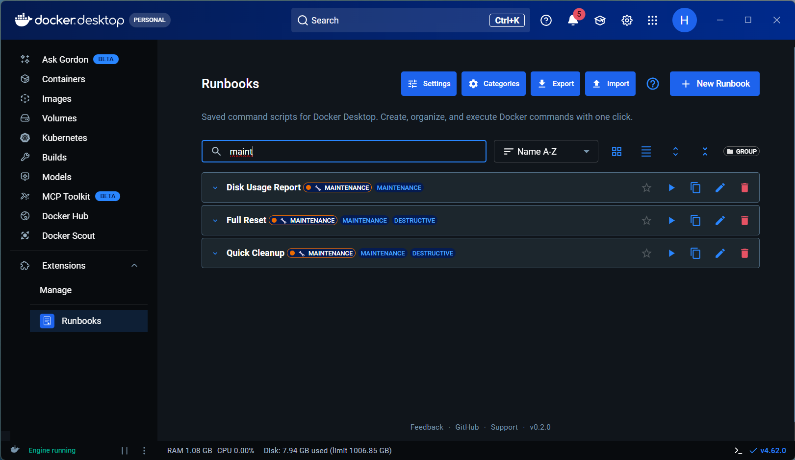
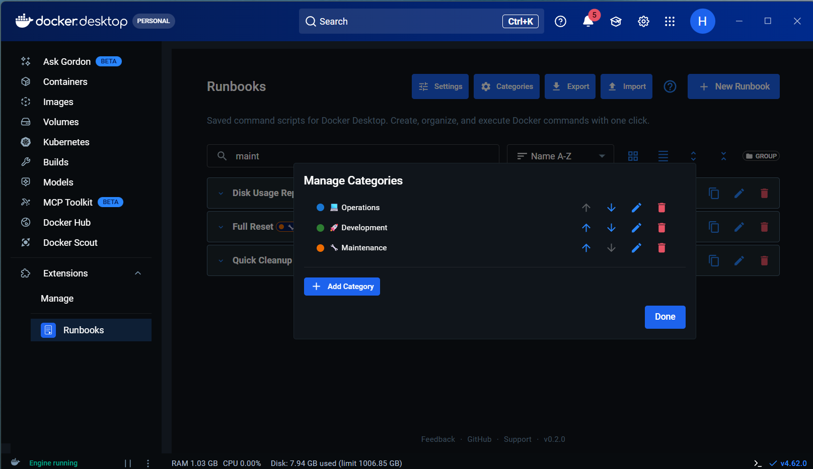

# Runbooks

[](https://github.com/HerbHall/Runbooks/actions/workflows/ci.yml)
[](https://opensource.org/licenses/MIT)

**Saved command scripts for Docker Desktop.**

A Docker Desktop Extension that lets you create, organize, and execute Docker command scripts with one click. Think of it as a personal runbook library built right into Docker Desktop.

## Screenshots

### Grid View



### Expanded Cards



### Search and Filter



### Category Grouping



## Features

### Core

- Create, edit, and delete Docker command scripts
- One-click execution with streaming output, auto-scroll, and elapsed timer
- Organize with tags, nested tag grouping, and color-coded categories
- Search, sort, and filter runbooks
- Grid and list layout modes with compact density option
- Collapsible cards with expand/collapse all
- Import/export runbooks as JSON

### Commands

- **Parameterized commands** with `{{name=default|option1,option2}}` variable syntax
- **Docker resource autocomplete** for container, image, volume, and network variables
- **Dry-run preview** showing resolved commands before execution
- Command validation with syntax highlighting
- Destructive command confirmation dialog (prune, rm, stop, kill, down)
- **Navigation links** to View Containers/Images/Volumes after execution

### Productivity

- **Keyboard shortcuts**: `Ctrl+N` new runbook, `/` focus search, `Ctrl+C` abort execution, `Ctrl+Enter` save dialog
- **Favorites**: pin runbooks with star icon, pinned items sort to top
- **Execution history**: last-run timestamp display and "Recently Executed" sort
- Copy-to-clipboard button on runbook cards
- Tag autocomplete with chip input
- Persistent group collapse state across reloads

### Settings and Help

- **Settings dialog** with toggle to show/hide example runbooks and reset-to-defaults
- **Getting Started guide** with features overview, keyboard shortcuts, and variable syntax reference
- Built-in example runbooks showcasing variables, autocomplete, multi-command, and destructive confirmation

## Installation

```bash
docker extension install herbhall/runbooks
```

Or build from source:

```bash
make build-extension
make install-extension
```

## Development

```bash
# Install UI dependencies
cd ui && npm install

# Start hot-reload dev server
npm run dev

# In another terminal — build and attach
cd ..
make build-extension
make install-extension
make dev-attach
```

### Testing

```bash
cd ui
npx vitest run         # Run 142 unit tests
npx tsc --noEmit       # Type check
npx eslint .           # Lint
```

### Quick Reinstall

```bash
make reinstall-extension   # Remove old, rebuild, and install fresh
```

## Architecture

Frontend-only Docker Desktop Extension built with React 18, TypeScript, Material UI 5, and Vite 7. Uses the Docker Extension SDK's `docker.cli.exec()` to run commands directly — no backend service required. All data persists in localStorage with JSON import/export for portability.

See `docs/decisions/` for Architecture Decision Records documenting all technical choices.

## Contributing

Contributions are welcome! See [CONTRIBUTING.md](CONTRIBUTING.md) for development setup and guidelines.

Please read our [Code of Conduct](CODE_OF_CONDUCT.md) before participating.

## Changelog

See [CHANGELOG.md](CHANGELOG.md) for a detailed history of changes.

## License

[MIT](LICENSE)

## Author

**Herb Hall** — [GitHub](https://github.com/HerbHall) · [herbhall.net](https://herbhall.net)
